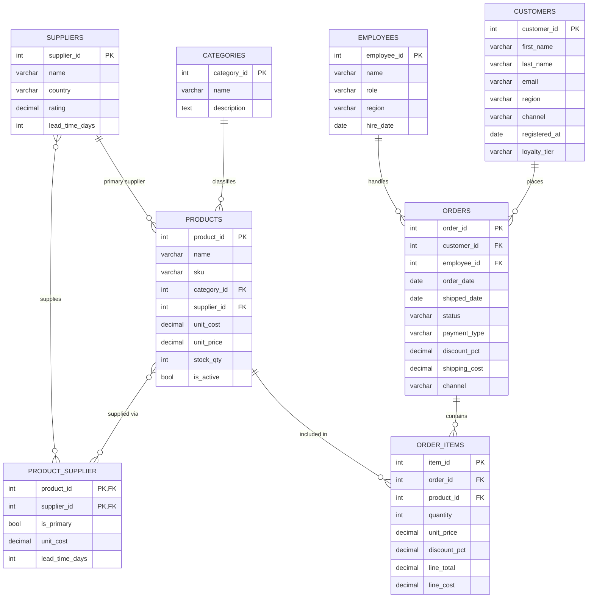

# Entity Relationship Diagram

> Rendered automatically by GitHub. View in any Mermaid-compatible viewer.

```mermaid
erDiagram
    CATEGORIES {
        int  category_id PK
        varchar name
        text description
    }

    SUPPLIERS {
        int     supplier_id PK
        varchar name
        varchar country
        decimal rating
        int     lead_time_days
    }

    PRODUCTS {
        int     product_id PK
        varchar name
        varchar sku
        int     category_id FK
        int     supplier_id FK
        decimal unit_cost
        decimal unit_price
        int     stock_qty
        bool    is_active
    }

    PRODUCT_SUPPLIER {
        int     product_id  PK,FK
        int     supplier_id PK,FK
        bool    is_primary
        decimal unit_cost
        int     lead_time_days
    }

    CUSTOMERS {
        int     customer_id PK
        varchar first_name
        varchar last_name
        varchar email
        varchar region
        varchar channel
        date    registered_at
        varchar loyalty_tier
    }

    EMPLOYEES {
        int     employee_id PK
        varchar name
        varchar role
        varchar region
        date    hire_date
    }

    ORDERS {
        int     order_id PK
        int     customer_id FK
        int     employee_id FK
        date    order_date
        date    shipped_date
        varchar status
        varchar payment_type
        decimal discount_pct
        decimal shipping_cost
        varchar channel
    }

    ORDER_ITEMS {
        int     item_id PK
        int     order_id   FK
        int     product_id FK
        int     quantity
        decimal unit_price
        decimal discount_pct
        decimal line_total
        decimal line_cost
    }

    CATEGORIES    ||--o{ PRODUCTS         : "classifies"
    SUPPLIERS     ||--o{ PRODUCTS         : "primary supplier"
    PRODUCTS      }o--o{ PRODUCT_SUPPLIER : "supplied via"
    SUPPLIERS     }o--o{ PRODUCT_SUPPLIER : "supplies"
    CUSTOMERS     ||--o{ ORDERS           : "places"
    EMPLOYEES     ||--o{ ORDERS           : "handles"
    ORDERS        ||--o{ ORDER_ITEMS      : "contains"
    PRODUCTS      ||--o{ ORDER_ITEMS      : "included in"
```
